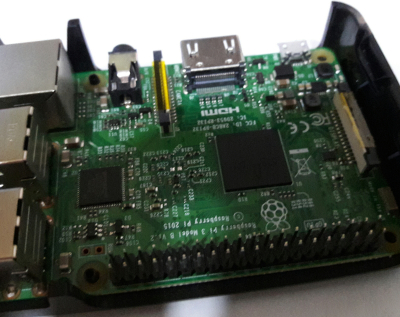
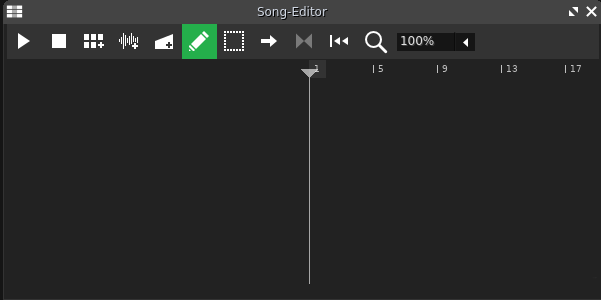

# Raspberry Pi Midi Pad


The Musical Instrument Digital Interface, or [MIDI](https://en.wikipedia.org/wiki/MIDI), is a standard for defining a sequence of musical events such as playing a note or changing the tempo. It is usually represented as a file with `.midi` or `.mid` extension. Unlike an [audio](https://en.wikipedia.org/wiki/Audio_file_format) file, such as `.wav` or `.mp3`, MIDI only contains the instruction on what, how and when the notes are to be played just like a music sheet; whereas an audio file is a stream of data that sounds _almost_ exactly as recorded.

For this project, we are going to animate an 8x8 LED Dot Matrix with MIDI while an audio file is playing.

## Architecture


This setup requires a Raspberry Pi and a desktop/laptop. The Raspberry Pi will run the Python script `server.py`, which communicates with the Pi's GPIO, which interfaces with the [MAX7219](https://datasheets.maximintegrated.com/en/ds/MAX7219-MAX7221.pdf) for controlling the 8x8 Dot Matrix. While the desktop or laptop will run the Python script `client.py`, which reads midi notes from a MIDI Sequencer and sends it to the Raspberry Pi via a [TCP](https://en.wikipedia.org/wiki/Transmission_Control_Protocol) socket.

## Hardware
Note: The hardware setup for this project is exactly the same as my other project: [RPi Stacker](/projects/rpi_stacker)



**Raspberry Pi** : Please enable [SPI](https://www.raspberrypi.org/documentation/hardware/raspberrypi/spi/README.md) on your Pi, follow [these](https://learn.sparkfun.com/tutorials/raspberry-pi-spi-and-i2c-tutorial/all#spi-on-pi) instructions.


**8x8 Dot Matrix with MAX7219** : Connect the MAX7219 to the Raspberry PI's GPIO following the table below:

### Pin Configuration

|MAX7219 |RPi|
|--------|---|
|Vcc     |  2|
|Gnd     |  6|
|Din     | 19|
|Cs      | 24|
|Clk     | 23|

### Network Setup

Since the Raspbbery Pi and our machine will talk via TCP, we need to make sure that they are on the same network. Make sure your Pi is connected to a network either by wired (via LAN cable) or wireless (WIFI), the same is true for your local machine. 

To test if your machine can communicate with your Raspberry Pi, simply run on the terminal:
```bash
$ ping <IP address of your Pi>
```

## Software

Let's get the source code to **both** the Raspberry Pi and the local machine:

```bash
$ git clone https://github.com/jedcua/rpi-midi-pad
```

Optional: You can setup [virtualenv](/articles/virtualenv). 

Then install the **both** dependencies:

```bash
$ pip3 install -r requirements.txt
```

On the Raspberry Pi, run `server.py`, which requires two arguments, the first is the _bind address_ and the second is TCP port

```bash
./server.py 0.0.0.0 9999
```

On your local machine, run `client.py`, which requires the IP address of the Raspberry Pi and the TCP port


```bash
./client.py <IP address of your Pi> 9999
```

### Setting up the MIDI Sequencer

For this project, I've installed [LMMS](https://lmms.io/), which can be downloaded and installed [here](https://lmms.io/download/). As of this writing, the current version is **1.2.0**

Open LMMS and select **File** then **New from Template** and choose **Empty**. Look for the **Song Editor** window



It's empty. Let us add a track so that we can input MIDI notes. On the left menu bar, click on **Instrument Plugins**, look for **SF2 Player** and _drag_ it to the **Song Editor** window.


Then, we have to configure **SF2 Player** to send MIDI data to our `client.py`. Click on the **gear** icon, navigate to **MIDI**, then select **RTMidiIn Client: Mido Port** 


Let's test if the Raspberry Pi receive's the MIDI data. Click on the **SF2 Player** track, a virtual keyboard should pop up. Trying playing the **C0** note, there should be a corresponding reaction from the LED Matrix connected to the Raspberry Pi.


This is it for now for this tutorial, there will be another article explaining the *mapping* between the notes and the LED Matrix and how you can create your own LED animations ;)

Here is a full demonstration:

<iframe width="800" height="450" src="https://www.youtube.com/embed/4VN_-QX-NgU" frameborder="0" allow="accelerometer; autoplay; encrypted-media; gyroscope; picture-in-picture" allowfullscreen></iframe>
