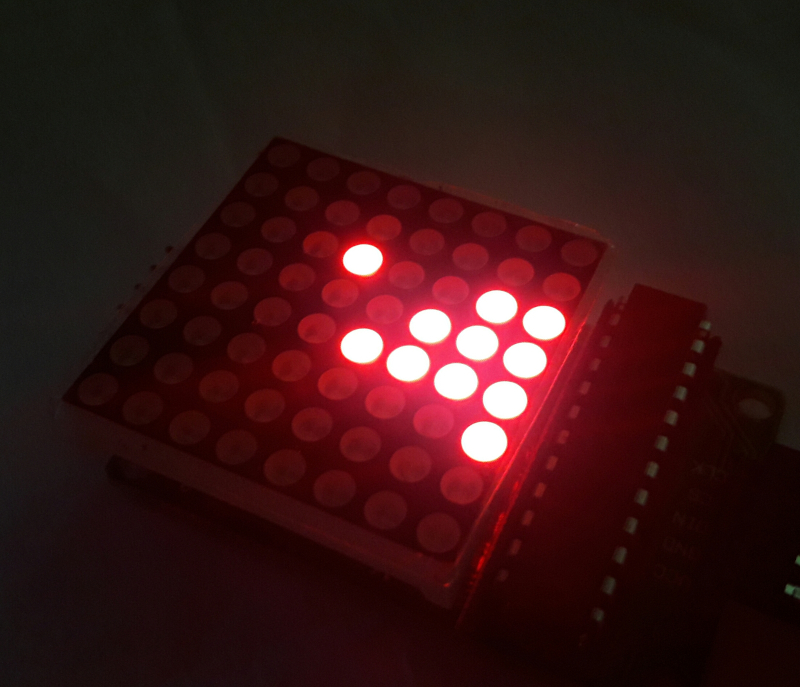
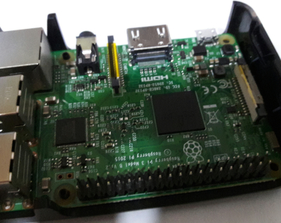
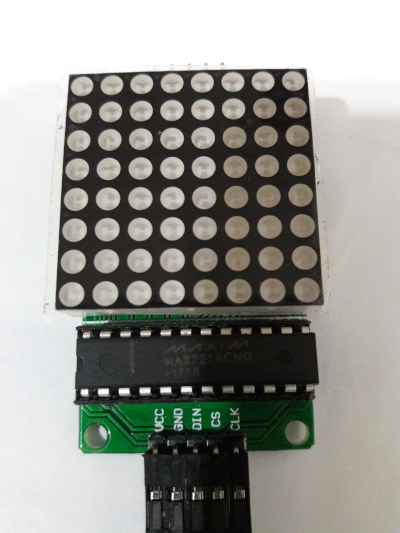

# Remaking Stacker with Raspberry Pi



What is [Stacker](https://en.wikipedia.org/wiki/Stacker_(arcade_game)) ? It's a classic arcade game where the player must stack horizontal lines as high as possible. However, the lines are moving back and forth horizontally, getting faster and faster every turn! The current line must be timed accurately to be aligned with the previous line; any excess line will be trimmed. Once the current line is gone, the game ends.

I really liked this game when I was young. And so my dear reader, I present my recipe for remaking Stacker:

## Hardware


**Raspberry Pi** : I've used my trusty 3B model for this project. However any variant is fine for as long as it supports [SPI](https://www.raspberrypi.org/documentation/hardware/raspberrypi/spi/README.md). To enable SPI on your Pi, follow [these](https://learn.sparkfun.com/tutorials/raspberry-pi-spi-and-i2c-tutorial/all#spi-on-pi) instructions



**8x8 Dot Matrix with MAX7219** : For this one, you can purchase them separately and wire them together. But the easiest would be to purchase one that is already connected to the MAX7219. [Here](https://www.amazon.com/s?k=max7219) is a good start.

### Pin Configuration
Now, let's wire the pins of our Raspberry Pi with MAX7219

|MAX7219 |RPi|
|--------|---|
|Vcc     |  2|
|Gnd     |  6|
|Din     | 19|
|Cs      | 24|
|Clk     | 23|


## Software
We would be using [Python](https://www.python.org/) for this. Make sure you have **Python3** runtime, and the package manager **Pip**, installed on your Pi. Also, we needed the version control system, **Git** installed. As far as I remember these are all installed by default on [Raspian](https://www.raspberrypi.org/downloads/raspbian).

Now, let's download the source code. First, let's `git clone` teh codez

```
$ git clone https://github.com/jedcua/rpi-stacker
```

Navigate to the project directory
```
$ cd rpi-stacker
```

If you wish, you may use [virtualenv](/articles/virtualenv) before this next step. Let's install the dependencies.
```
$ pip install -r requirements.txt
```

Almost there! Now, let's run the game.
```
$ ./stacker.py
```


Nice! To play this game just hit `SPACEBAR` and the line will stop each turn. This game will run indefinitely, getting faster every turn, until the line is gone then the player loses. I've also added a twist where after the game reaches a certain point the screen will rotate randomly per turn! I got **30 points** on this game, let's see you try to beat that ;)

If you've got some ideas with this game feel free to submit a merge request.