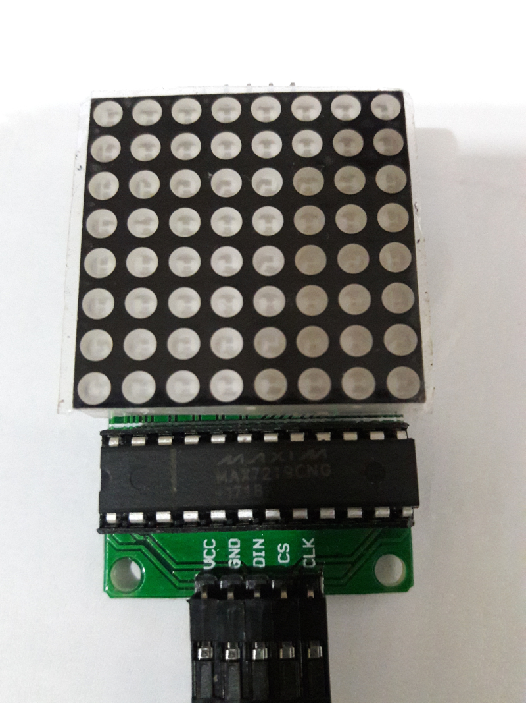

# Remake Stacker with Raspberry Pi!


Remember playing on the arcade as a kid? Yeah, that was awesome..remember? we.. Oh! you don't know what an arcade is?? Err, its a place where kids and grown up adults (_whose in denial of being an adult and still acts like a child, like me_) plays video games that requires paying some form of currency, often called tokens.

I remember there was 1 particular game that I liked playing, where you'd have to time pressing the button so that the dots will line up, until you reach the top in exchange of a cool prize. When a dot doesn't line up, it gets eliminated. When you don't have any more dots its game over.

Given that I, as a full grown responsible adult, don't have the luxury of time to visit the arcade and play this game; the spirit of the software developer inside me exalts, _"Hey! Why don't we make that game!?"_

And so, my dear reader, I present to you, my recipe for remaking Stacker:

## Hardware


**Raspberry Pi** : I've used my trusty 3B model for this project. Feel free to use any variant you have, the only requirement is that your Pi needs to have **SPI**. If you want to know how to enable your Pi's SPI, click [here](https://www.raspberrypi.org/documentation/hardware/raspberrypi/spi/README.md), or just Google it you lazy ;). **HINT**: `raspi-config`



**8x8 Dot Matrix with MAX7219** : For this one, you can buy them separately, or you can buy them together. [Here](https://www.amazon.com/s?k=max7219) is a good start.

## Pin Configuration
Now, let's try connecting the Pi with MAX7219

|MAX7219 |RPi|
|--------|---|
|Vcc     |  2|
|Gnd     |  6|
|Din     | 19|
|Cs      | 24|
|Clk     | 23|


## Software
Hey, do you know [Python](https://www.python.org/)? Yes? Great! If not, don't worry it will not bite, at least not yet. For this project, we will be using **Python 3**

Now, let's fetch the source code [here](https://github.com/jedcua/rpi-stacker). First, let's `git clone` teh codez

```
git clone https://github.com/jedcua/rpi-stacker
```

Just go to the project directory
```
cd rpi-stacker
```

If you wish, you may use [`virtualenv`](/articles/virtualenv) before this next step. But for starters let's install the dependencies needed
```
pip install -r requirements.txt
```

Almost there! Now, release the kraken! (I mean the python, sorry)
```
./stacker.py
```


To stop the dots and place it just press `<SPACEBAR>`, the game will run indefinitely, getting faster every turn, until all dots are gone and the player loses. I got **30 points** on this game, let's see you beat that ;)